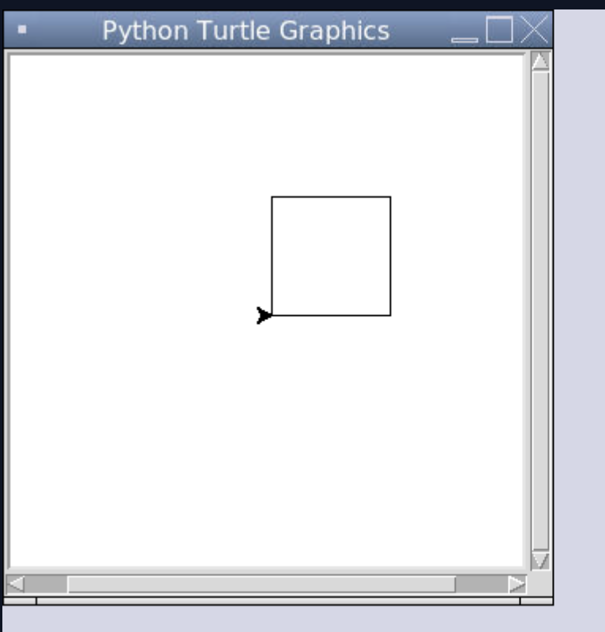
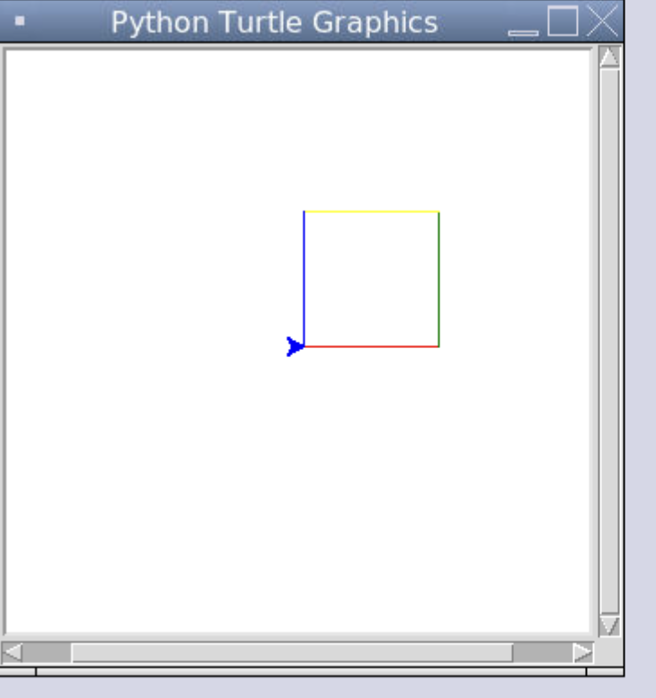
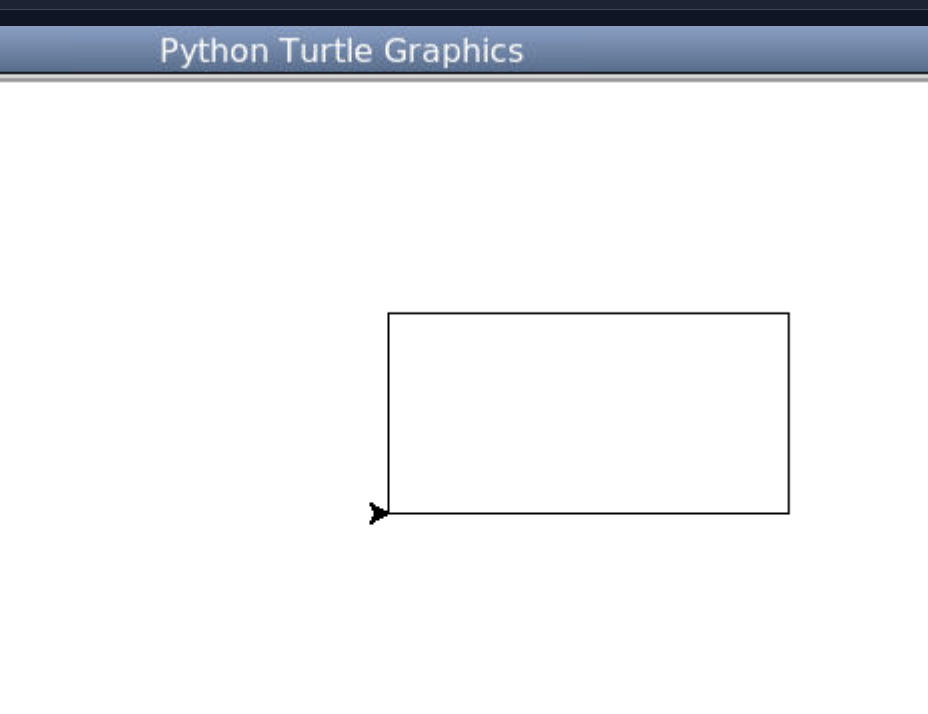
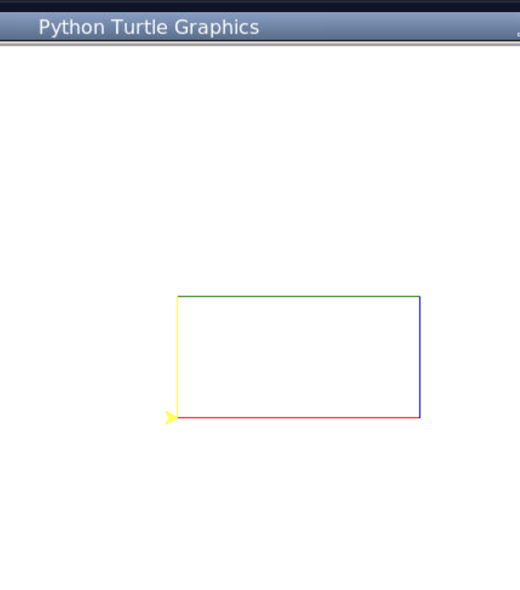
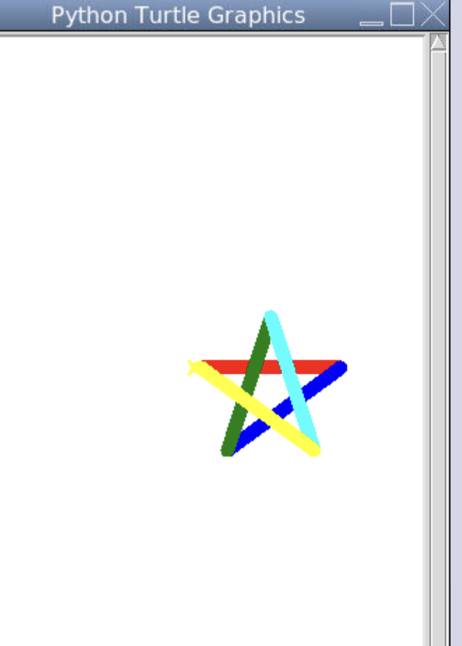

# Instructions  

Use python [🐢 turtle 🐢](https://docs.python.org/3/library/turtle.html) to draw the following


See these youtube videos:

- https://youtu.be/ogsRn1XSy5c
- https://youtu.be/0nGwqUT43TA 


# 01 - Square


# 02 - Square with 4 color

  

# 03 - Rectangle


# 04 - Rectangle with 4 color



# 05 - Star with 5 color



# 06 - Write your name

`¯\_(ツ)_/¯`

# Starter code

> copy and paste it, then hit `run` to see what it does 

```py
"""
This is the Template Repl for Python with Turtle.

Python with Turtle lets you make graphics easily in Python.

Check out the official docs here: https://docs.python.org/3/library/turtle.html
"""

# DO NOT DELETE THE BELOW CODE
import turtle
t = turtle.Turtle()
t.shape('turtle') 
# DO NOT DELETE THE ABOVE CODE
 
t.fillcolor('cyan')

t.forward(150)
t.left(90)
t.backward(150)
t.left(90)
t.forward(150)
 

```